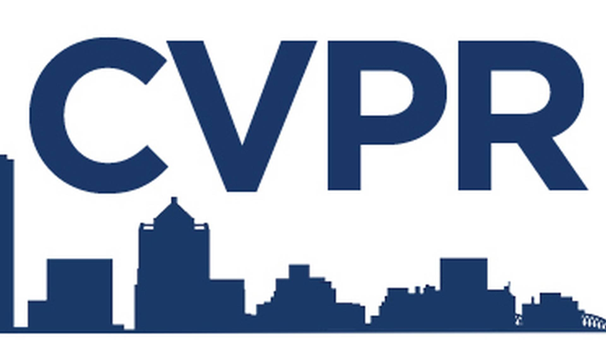

Stay updated on paper submission deadlines for top AI conferences as well as leading journals. Never miss a deadline for your research—bookmark this page for the latest AI conference and journal timelines!

| Icon                                           | Name                                                           | Type       | URL                                                                            | Paper submission deadline |
| --------                                       | ------                                                         | ----       | ---                                                                            | ------------------------- |
|      | European Conference on Computer Vision                         | Conference | [eccv.ecva](https://eccv.ecva.net/Conferences/2026)                            | March 6, 2026             |
|      | International Conference on Computer Vision                    | Conference | [iccv.thecvf](https://iccv.thecvf.com/)                                        | March 7, 2025             |
|      | International Conference on Machine Learning                   | Conference | [icml.cc](https://icml.cc/)                                                    | January 30, 2025          |
|      | Conference on Computer Vision and Pattern Recognition          | Conference | [cvpr.thecvf](https://cvpr.thecvf.com/)                                        | November 1, 2024          |
|      | International Conference on Learning Representations           | Conference | [iclr.cc](https://iclr.cc/)                                                    | October 1, 2024           |
|     | Association for the Advancement of Artificial Intelligence     | Conference | [aaai.org](https://aaai.org/)                                                  | July 1, 2024              |
|     | IEEE/CVF Winter Conference on Applications of Computer Vision  | Conference | [wacv2025.thecvf](https://wacv2025.thecvf.com/)                                | July 1, 2024              |
|  | Neural Information Processing Systems                          | Journal    | [neurips.cc](https://neurips.cc/)                                              |                           |
|     | International Journal of Computer Vision                       | Journal    | [link.springer](https://link.springer.com/journal/11263)                       |                           |
|     | IEEE Transactions on Pattern Analysis and Machine Intelligence | Journal    | [ieeexplore.ieee](https://ieeexplore.ieee.org/xpl/RecentIssue.jsp?punumber=34) |                           |
|       | IEEE Transactions on Image Processing                          | Journal    | [ieeexplore.ieee](https://ieeexplore.ieee.org/xpl/RecentIssue.jsp?punumber=83) |                           |

